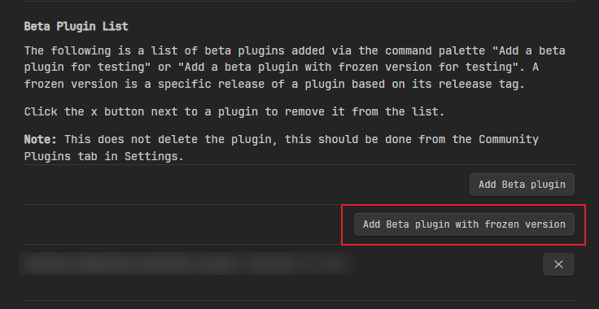

# Obsidian Local Images Expand

[English](./README_EN.md)

Obsidian Local Images Expand 是一个Obsidian桌面插件。

> 2.0.0版本后将支持移动场景使用，详见2.0.0-beta.0版本

插件核心功能为找到笔记中的外部图片，将外部图片下载到本地后替换笔记中的引用。

## 功能

支持使用场景两种：

### 自动替换：粘贴后自动下载并替换


### 调用命令：


- 下载当前笔记图片： Local images - Expand: Download images locally
- 下载所有笔记图片： Local images - Expand: Download images locally for all youer notes

## 安装

先安装 [Obsidian42](https://github.com/TfTHacker/obsidian42-brat) 这个插件。用来支持安装来自Github仓库的插件。

然后点击下面按钮：



输入如下内容：

- `Repository`：lpreterite/obsidian-local-images-expand
- `Version`：1.2.1

> 提示找不到`manifest.json`可能是你所在的网段，无法访问Github导致。

接下来，去**第三方插件**找到 `Local images - Expand` 启用就可以了。

## 配置说明

| 配置项                       | 默认值  | 使用说明                           |
|------------------------------|---------|--------------------------------|
| realTimeUpdate               | false   | 是否启用实时更新功能（自动替换）     |
| realTimeUpdateInterval       | 1000    | 实时更新检查间隔（毫秒）             |
| realTimeAttemptsToProcess    | 3       | 实时更新尝试处理次数               |
| cleanContent                 | true    | 是否清理内容格式                   |
| showNotifications            | false   | 是否显示通知提醒                   |
| include                      | .*\\.md | 需要处理的文件匹配规则（正则表达式） |
| mediaRootDirectory           | media   | 图片保存的根目录名                 |
| mediaRootDirectoryBaseOnFile | true    | 是否基于文件位置创建图片目录       |
| useRelativePath              | false   | 是否使用相对路径引用图片           |

## 其他说明

### 存放图片的位置

插件支持两种使用情况：

#### 集中在目录根

部分用户希望存所有资源集中存放在目录根下的`medias`目录中。这类用户请将配置`mediaRootDirectoryBaseOnFile`设为`false`即可。

希望笔记引用的路径为相对路径（如：`../medias/xxx.png`），将`useRelativePath`设为`true`即可。

以下是存放内容示例：

```
notes/
 - medias/
  - xxx.png
 - examples/
  - post1.md
```

#### 放在笔记所在目录

另一类用户希望将图片资源存放在笔记同一目录下。这类用户请将配置`mediaRootDirectoryBaseOnFile`设为`ture`。

还有部分用户希望存放的图片资源以笔记标题的目录进行存放，这类用户请在配置`mediaRootDirectory`中添加目录标记，像这样：`assets/${fileBaseName}`。

以下是存放内容示例：

```
notes/
 - examples/
  - assets/
   - post1/
    - xxx.png
  - post1.md
```

### 下载图片文件名称的说明

我的使用场景中经常遇到无法获得图片资源名称的情况，所以目前统一使用MD5作为图像文件的名称。在最近的2.0.0-beta.0版本中，为了适应移动场景下可用，移除了所有Nodejs依赖，使用浏览器支持的SHA256来命名图像文件的名称。使用过程中对图像文件名称有不同诉求的，可以在issues中反馈。

## Credit

这插件是fork [aleksey-rezvov/obsidian-local-images](https://github.com/aleksey-rezvov/obsidian-local-images)的项目进行二次修改的。 见 aleksey-rezvov 长久未维护，我自己也有一些新诉求，便进行了二次开发。最后感谢 aleksey-rezvov 为我们带来的贡献

