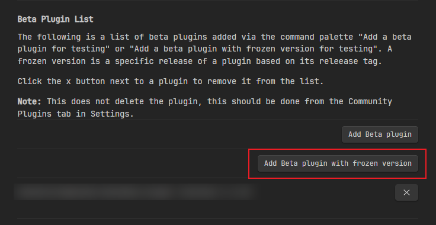

# Obsidian Local Images Expand

[中文](./README.md)

Obsidian Local Images Expand is a desktop plugin for Obsidian.

> Version 2.0.0 and above will support mobile usage, see version 2.0.0-beta.0 for details

The core function of this plugin is to locate external images in notes, download them locally, and replace the references in the notes.

## Features

Supports two usage scenarios:

### Automatic Replacement: Download and Replace After Pasting


### Command Invocation


- Download images for current note: Local images - Expand: Download images locally
- Download images for all notes: Local images - Expand: Download images locally for all your notes

## Installation

First, install the [Obsidian42](https://github.com/TfTHacker/obsidian42-brat) plugin. This plugin supports installing plugins from Github repositories.

Then click the button below:



Enter the following information:

- `Repository`: lpreterite/obsidian-local-images-expand
- `Version`: 1.2.1

> If you receive a "manifest.json not found" error, it may be due to network connectivity issues with Github in your region.

Next, go to **Community Plugins** to find and enable `Local images - Expand`.

## Configuration

| Configuration Item           | Default Value | Description                                     |
|------------------------------|---------------|-------------------------------------------------|
| realTimeUpdate               | false         | Enable real-time update (automatic replacement) |
| realTimeUpdateInterval       | 1000          | Real-time update check interval (milliseconds)  |
| realTimeAttemptsToProcess    | 3             | Number of real-time update processing attempts  |
| cleanContent                 | true          | Clean up content format                         |
| showNotifications            | false         | Show notification reminders                     |
| include                      | .*\\.md       | File matching pattern for processing (regex)    |
| mediaRootDirectory           | media         | Root directory name for image storage           |
| mediaRootDirectoryBaseOnFile | true          | Create image directory based on file location   |
| useRelativePath              | false         | Use relative paths for image references         |

## Additional Information

### Image Storage Location

The plugin supports two usage scenarios:

#### Centralized in Root Directory

Some users prefer to store all resources centrally in a `medias` directory under the root directory. These users should set `mediaRootDirectoryBaseOnFile` to `false`.

If you want the note references to use relative paths (e.g., `../medias/xxx.png`), set `useRelativePath` to `true`.

Here's an example of the storage structure:

```plaintext
notes/
 - medias/
  - xxx.png
 - examples/
  - post1.md
```

#### Store in Note Directory

Other users prefer to store image resources in the same directory as the notes. These users should set `mediaRootDirectoryBaseOnFile` to `true`.

Some users want to store image resources in directories named after note titles. These users can add directory markers in the `mediaRootDirectory` configuration, like this: `assets/${fileBaseName}`.

Here's an example of the storage structure:

```plaintext
notes/
 - examples/
  - assets/
   - post1/
    - xxx.png
  - post1.md
```

### About Downloaded Image Filenames

In my usage scenarios, I often encounter situations where image resource names cannot be obtained, so MD5 is currently used uniformly as the image filename. In the recent 2.0.0-beta.0 version, to accommodate mobile scenarios, all Node.js dependencies have been removed, and SHA256 (supported by browsers) is used to name image files. If you have different requirements for image filenames during use, please provide feedback in the issues.

## Credit

This plugin is a fork of [aleksey-rezvov/obsidian-local-images](https://github.com/aleksey-rezvov/obsidian-local-images) with secondary modifications. Since aleksey-rezvov had not maintained it for a long time and I had some new requirements, I proceeded with secondary development. Finally, thanks to aleksey-rezvov for their contribution.
